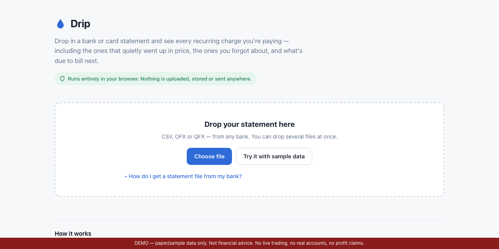

# Drip

[](https://suncal.github.io/drip/) [](LICENSE) [](https://github.com/suncal/drip/stargazers)



**Find the money leaking out of your accounts.** Drop in a bank or card
statement and see every recurring charge you're paying — including the ones
that quietly went up in price, the ones you forgot about, and what's due to
bill next.

Runs entirely in the browser. No server, no account, no upload, no dependencies.
Open `index.html` from your desktop and it works with the internet switched off.

---

## Why it exists

Every subscription tracker — Rocket Money, Copilot, Monarch — asks you to hand
your bank login to a third party so it can read your transactions for you. That
is a lot of trust for a problem that is, underneath, arithmetic on a file your
bank will happily give you.

Drip does the arithmetic locally. Nothing leaves the page. You can verify that
claim yourself: open dev tools, look at the Network tab, and watch it stay
empty.

## What it finds

- **Every recurring charge**, with its cadence, typical amount, monthly and
  yearly cost, and a confidence score
- **Price rises** — a charge that stepped up and stayed up, with what the
  increase costs you per year
- **Yearly renewals coming up**, predicted from the pattern rather than
  announced by your bank — these are the ones that catch people out
- **Easy to forget**: small amounts that have been going out for a long time
- **Overlaps**: several services in the same category at once
- **Things that stopped** — sometimes a failed card silently cancels something
  you wanted
- **Unusually large one-offs**, measured against your own spending rather than
  a fixed threshold

Household bills (rent, utilities, insurance, phone, loans) are separated from
subscriptions, so the headline number is the part you could actually change
rather than being dominated by your rent.

## How the detection works

Charges are grouped by merchant, then the gaps between them are measured using
the **median gap and the median absolute deviation** of those gaps — not the
mean and standard deviation.

That distinction is the whole trick. A single skipped month, a retried payment
or a charge posted two days late throws a standard-deviation score badly off,
while leaving MAD essentially unchanged. Real subscriptions skip, retry and post
late constantly, so the robust statistic is the one that survives contact with
real statements.

Calendar months are handled separately from day-gaps, because "the 5th of every
month" produces gaps of 28, 30 and 31 days — irregular in days, perfectly
regular in months.

Two further problems that matter on real data:

- **Yearly subscriptions.** An 18-month export contains exactly two annual
  renewals, and two points cannot prove regularity. Rather than hide them, Drip
  accepts a pair whose gap lands on a long cadence *and* whose amounts match,
  caps the confidence, and labels it `only 2 charges` with the caveat spelled
  out.
- **One merchant, several subscriptions.** Apple, Google and PayPal descriptors
  bundle everything behind them, and services run monthly and yearly plans side
  by side. Merged, the amounts look erratic and nothing is detected. Drip splits
  a merchant into separate series when its amounts form clearly separated
  clusters.

Merchant resolution strips payment-processor wrappers (`SQ *`, `TST*`,
`PAYPAL *`, `POS DEBIT`), then store numbers, reference ids, phone numbers,
locations and embedded dates, before matching against ~200 known merchants with
categories. Deliberately distinct products are never merged — Amazon Prime is
not Amazon, Google One is not Google.

Every number on screen expands to the exact statement rows behind it. If a tool
tells you to cancel something, you should be able to see the charges it based
that on.

## File formats

- **CSV / TSV** from any bank. Delimiter, header row, column roles, date format
  and sign convention are all inferred — nothing to configure.
- **OFX / QFX** ("Quicken format"), for banks that don't offer CSV.
- Several files at once — drop your current account *and* your credit cards
  together. Subscriptions hide on the card you look at least. Duplicate rows
  from overlapping date ranges are removed automatically.

Two inferences silently produce wrong answers if done lazily, so both are
decided by scanning the whole file rather than guessing from the first row:
**DD/MM vs MM/DD** (settled by any day value above 12) and **which sign means
money leaving**. When the evidence is genuinely ambiguous, Drip says so in a
banner instead of quietly picking one.

## Running it

Open `index.html`. That's it.

To host it:

```bash
cd drip && python3 -m http.server 4466
```

For GitHub Pages, push the folder and enable Pages on the branch — there is no
build step.

## Files

```
index.html      page structure
style.css       light and dark, no framework
parse.js        CSV/OFX parsing, format and convention inference
merchants.js    merchant resolution + known-merchant table
analyze.js      recurrence, price change, anomaly detection
sample.js       synthetic statement for the demo button
app.js          UI and provenance drill-down
```

## Limits, honestly

- Short exports find less. Most subscriptions need three charges; **12–24
  months is the sweet spot**, and yearly ones need at least two renewals in
  range.
- PDF statements are not supported. Use CSV or OFX.
- Merchant names Drip had to guess from raw text are marked `name guessed` and
  will sometimes look rough.
- Variable-amount charges (utilities, usage-based billing) are detected as
  recurring but price-change detection is skipped for them, since there's no
  stable price to compare against.
- Drip is a reading aid, not financial advice. It only sees what's in the files
  you give it. Check a charge against your actual statement before cancelling
  anything.

---

**If this is useful to you, a ⭐ on the repo helps other people find it.** Issues and pull requests are welcome.

Built by [Priyankar "Sunny" Chakraborty](https://github.com/suncal) · [everbuiltstudio.com](https://everbuiltstudio.com)
